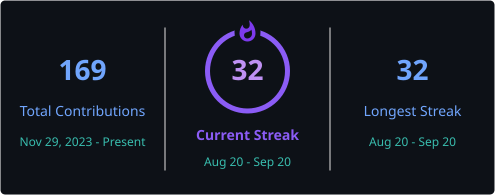

<!-- ======================= HEADER ======================= -->

<div align="center">


<br/>

<a href="https://git.io/typing-svg">

</a>

<br/><br/>


<br/><br/>

<a href="https://lokhnadhgembali.vercel.app/">

</a>

<a href="https://www.linkedin.com/in/lokhnadh/">

</a>

<a href="mailto:lokhnadhgembali@gmail.com">

</a>

<a href="https://github.com/lokhnadhgembali">

</a>

<br/><br/>


</div>

---

# 👨‍💻 About Me

I'm **Gembali Lokhnadh**, a Computer Science Engineering student focused on **Data Analytics, AI/ML, and software development**.

I enjoy transforming raw data into meaningful insights and building practical, data-driven applications. My experience spans **Python, SQL, Power BI, Microsoft Excel, machine learning, backend development, and modern web technologies**.

Currently, I'm strengthening my expertise in:

- 📊 Data Analytics & Visualization
- 🤖 Machine Learning
- 🐍 Python Development
- 📈 Power BI & Business Intelligence
- 🗄️ SQL & Database Management
- 🌐 Full-Stack Development
- 🔐 Secure Backend Systems
- 🌱 Open Source Development

### Open To

**Data Analyst • Data Science • AI/ML • Software Development • Open Source Opportunities**

---

# 🛠️ Tech Stack

### Languages

<p align="center">

</p>

### Data & Analytics

<p align="center">


</p>

### Machine Learning

<p align="center">


</p>

### Web & Backend

<p align="center">

</p>

### Databases & Tools

<p align="center">

</p>

---

# 🤖 AI / ML Expertise

| Domain | Proficiency | Details |
|---|---|---|
| Data Preprocessing | Advanced | Data cleaning, validation, feature engineering |
| Exploratory Data Analysis | Advanced | Statistical exploration and visualization |
| Classification | Intermediate | Logistic Regression, Random Forest, XGBoost |
| Machine Learning | Intermediate | Model training, evaluation and comparison |
| Feature Engineering | Intermediate | Scaling, transformation and feature selection |
| Model Evaluation | Intermediate | Accuracy, cross-validation, confusion matrices |
| Data Visualization | Advanced | Power BI, Matplotlib, Seaborn |
| NLP | Intermediate | TF-IDF based text classification |
| Dashboard Development | Advanced | Interactive Power BI dashboards |

---

# 🚀 Featured Projects

<details>
<summary><b>🔎 JobCheck — Fake Job Detection Platform</b></summary>

<br/>

An AI-powered platform designed to detect fraudulent job postings using machine learning and real-time monitoring.

| Category | Details |
|---|---|
| **Stack** | Python, FastAPI, SQLite, Next.js, React, Tailwind CSS |
| **Scale** | 18K+ job postings |
| **Performance** | 97.2% classification accuracy |
| **Security** | JWT Authentication |
| **Impact** | 3× faster fraudulent listing detection |
| **Repository** | GitHub |

### Highlights

- Built an AI-powered fake job detection platform.
- Developed a machine learning classification workflow.
- Engineered a secure backend using FastAPI.
- Implemented JWT authentication.
- Optimized database management workflows.
- Built a responsive administrative dashboard.
- Added real-time activity tracking for fraud monitoring.

</details>

---

<details>
<summary><b>🎵 Music Genre Classification</b></summary>

<br/>

A multiclass machine learning system for predicting music genres using audio metadata and ensemble learning techniques.

| Category | Details |
|---|---|
| **Stack** | Python, Random Forest, XGBoost |
| **Scale** | 40K+ music tracks |
| **Performance** | 89% classification accuracy |
| **Evaluation** | Cross-validation, confusion matrix |
| **Techniques** | Feature engineering, scaling, ensemble learning |
| **Repository** | GitHub |

### Highlights

- Built a multiclass music genre classification system.
- Trained and compared Random Forest and XGBoost models.
- Processed raw audio metadata using feature engineering.
- Applied scaling techniques to improve model generalization.
- Used cross-validation for comparative model evaluation.
- Analyzed feature importance and confusion matrices.

</details>

---

<details>
<summary><b>✈️ Airline Service Quality Analysis Dashboard</b></summary>

<br/>

An interactive Power BI dashboard analyzing passenger satisfaction, service quality and operational inefficiencies.

| Category | Details |
|---|---|
| **Stack** | Power BI |
| **Scale** | 10K+ passenger records |
| **Performance** | 7% improvement in data accuracy |
| **Visualization** | 10+ KPI cards, slicers and trends |
| **Analysis** | Flight delays, service quality, passenger feedback |
| **Repository** | GitHub |

### Highlights

- Developed an interactive Power BI dashboard.
- Analyzed passenger satisfaction trends.
- Identified service gaps across airline operations.
- Cleaned and validated data to improve accuracy.
- Designed KPI-driven visualizations.
- Analyzed flight delays and customer feedback.
- Generated actionable business insights.

</details>

---

# 💼 Experience

## Infosys Springboard

**AI / Software Development Intern**  
`Feb 2026 – Apr 2026`

Worked on an AI-powered fake job detection platform focused on identifying fraudulent job postings.

### Responsibilities

- Developed backend functionality using **Python and FastAPI**.
- Worked with **SQLite** for database management.
- Implemented secure authentication workflows using **JWT**.
- Contributed to a responsive administrative dashboard.
- Worked with **Next.js, React and Tailwind CSS**.
- Supported real-time fraud monitoring functionality.
- Built solutions capable of detecting fraudulent listings significantly faster.

**Skills:**  
`Python` `FastAPI` `SQLite` `Next.js` `React` `Tailwind CSS` `JWT`

---

# 🏆 Achievements

<div align="center">

| Recognition | Details |
|---|---|
| 🌱 **GSSoC 2026** | Open Source Contributor at GirlScript Summer of Code |
| 💻 **LeetCode** | Solved 100+ problems |
| ⭐ **HackerRank** | Earned 5-star rating in C++ |

</div>

---

# 📜 Certifications

### IBM


### Cisco Networking Academy


### NPTEL


### HackerRank


### FreeCodeCamp


---

# 💻 Coding Profiles

<div align="center">
<a href="https://leetcode.com/u/Lokhnadh/"></a>
<a href="https://www.hackerrank.com/profile/lokhnadhgembali"></a>
<a href="https://www.geeksforgeeks.org/profile/lokhnadhgembali?tab=activity"></a>
<a href="https://www.codechef.com/users/lokhnadh_2005"></a>
</div>

---

# 📊 GitHub Analytics

<div align="center">





</div>

<br/>

<div align="center">

</div>

---

# 🏅 GitHub Trophies

<div align="center">

</div>

---

# 📈 Contribution Activity

<div align="center">

</div>

---

# 🐍 Contribution Snake

<div align="center">

</div>

---

# 🎯 Current Focus

```yaml
current_focus:
  learning:
    - Advanced Data Analytics
    - Machine Learning
    - SQL
    - Power BI
    - Backend Development

  building:
    - Data-driven applications
    - Machine Learning projects
    - Interactive dashboards
    - AI-powered solutions

  exploring:
    - AI/ML
    - Data Science
    - Full Stack Development
    - Open Source

  open_to:
    - Data Analyst Opportunities
    - Data Science Opportunities
    - AI/ML Opportunities
    - Software Development
    - Open Source Collaboration
```